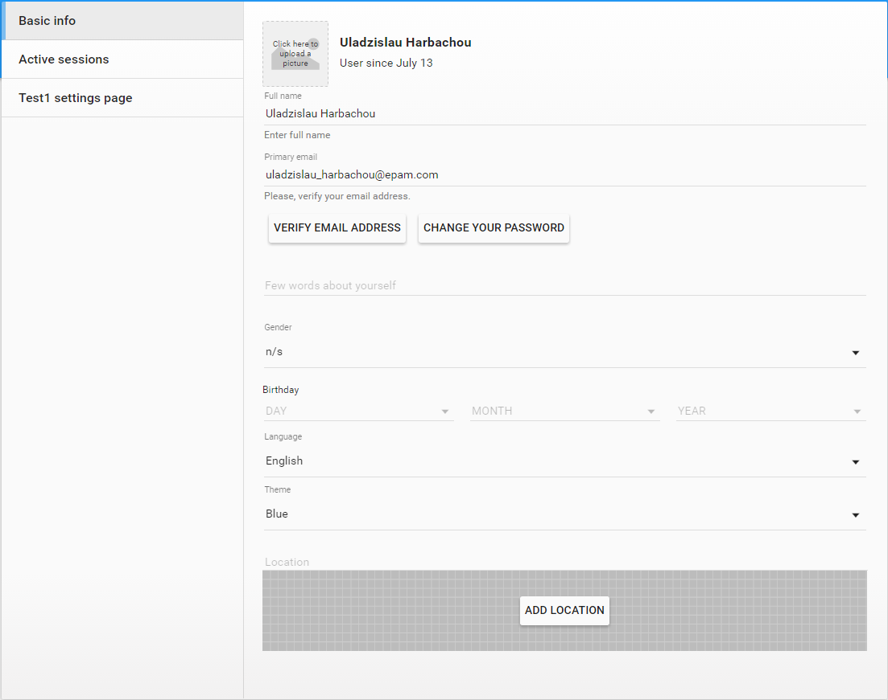

#    Settings page

Settings page allows users to set their preferences and change application settings.
Pip.WebUI.Settings module provides standard extensible settings page that can be filled with tabs by application developers.
The module also contains few standard settings tabs for basic user info and active sessions.

### pipSettings Provider

pipSettings provider allows to configure Settings page and fill it with standard or custom tabs.

Todo: Add code snippet that shows how to configure Settings page

### Basic Info tab

Basic Info tab allows to change user account and set preferences like language, theme. 
Also here user change change his password or verify his primary email address.
This tab requires presence of the standard **users** REST API.

Todo: change this image with better, smaller version

### Active Sessions tab

Active Sessions tab shows currently open user sessions and allows to close them.
This tab requires presence of the standard **sessions** REST API.

Todo: change this image with better, smaller version

## Learn more about the module

- [User's guide](doc/UsersGuide.md)
- [API reference](http://webui-api.pipdevs.com/pip-webui-settings/index.html)
- [Online samples](http://webui.pipdevs.com/pip-webui-settings/index.html)
- [Developer's guide](doc/DevelopersGuide.md)
- [Changelog](CHANGELOG.md)
- [Pip.WebUI project website](http://www.pipwebui.org)

## Module dependencies

* [pip-webui-lib](https://github.com/pip-webui/pip-webui-lib): angular, angular material and other 3rd party libraries
* [pip-webui-css](https://github.com/pip-webui/pip-webui-css): CSS styles and web components
* [pip-webui-core](https://github.com/pip-webui/pip-webui-core): localization and other core services
* [pip-webui-rest](https://github.com/pip-webui/pip-webui-rest): REST resources for users, files and sessions
* [pip-webui-controls](https://github.com/pip-webui/pip-webui-controls): date and time controls (??)
* [pip-webui-locations](https://github.com/pip-webui/pip-webui-locations): location control to show current user and signin locations
* [pip-webui-pictures](https://github.com/pip-webui/pip-webui-pictures): user avatar control

## License

This module is released under [MIT license](License) and totally free for commercial and non-commercial use.
