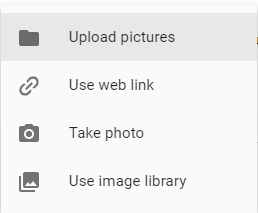

## How to use it

### **Basic info** page features
_<span style="color:red;">This page required authenticated state.<span>_

<a name="settings_basic_info"></a>'Basic info' page example
<a href="images/img-settings-basic-info.png" style="border: 1px ridge #ccc; width: 50%;  display: block">
    
</a>

[Online example](http://webui.pipdevs.com/pip-webui-settings/index.html#/settings/basic_info)

List of features:

* change email
* change password
* add location
* point out his/her personal info
* upload avatar
    
    <a href="images/pic_profile.png" style="border: 1px ridge #ccc; width: 260px; margin-left: 30px; display: block; float: left;">
        
    </a>

```javascript

```
### <a name="settings_sessions"></a>'Active sessions' page
_<span style="color:red;">This page required authenticated state.<span>_
<a href="images/img-settings-active-sessions.png" style="border: 1px ridge #ccc; width: 50%; display: block !important;">
    
</a>

[Online Example](http://webui.pipdevs.com/pip-webui-settings/index.html#/settings/sessions)

This page notified user about devices or locations where used the same credentials. 
And user can close unfamiliar session. This page also required authenticated state.


### **Settings service** page feature
Settings service provides an interface for configuring UI component. It implements next features:

* add new page into component navigation menu
* establish default page, which will be opened within component entrance


### Browser support:
 
 * IE11+
 * Edge
 * Chrome 47+
 * Firefox 43
 * Opera 35