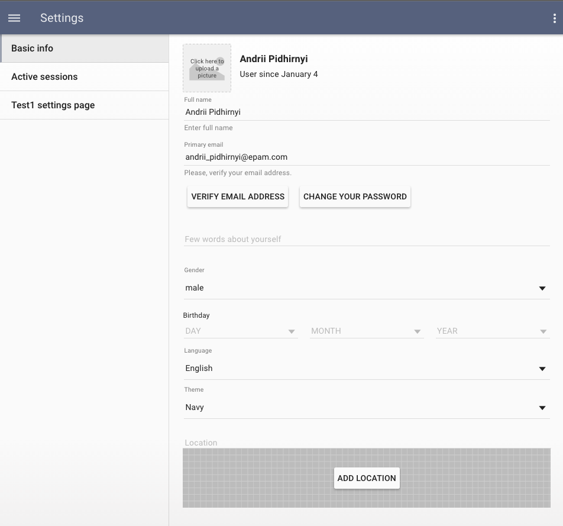
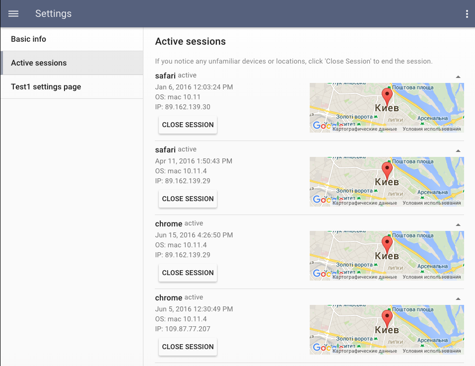

# Pip.WebUI.Settings User's Guide

## <a name="contents"></a> Contents
- [Installing](#install)
- [pipSettings provider](#settings_provider)
- [Settings page](#settings_page)
- [Basic Info tab](#basic_info_tab)
- [Active Sessions tab](#active_sessions_tab)
- [Questions and bugs](#issues)


## <a name="install"></a> Installing

Add dependency to **pip-webui** into your **bower.json** or **package.json** file depending what you use.
```javascript
"dependencies": {
  ...
  "pip-webui": "*"
  ...
}
```

Alternatively you can install **pip-webui** manually using **bower**:
```bash
bower install pip-webui
```

or install it using **npm**:
```bash
npm install pip-webui
```

Include **pip-webui** files into your web application.
```html
<link rel="stylesheet" href=".../pip-webui-lib.min.css"/>
<link rel="stylesheet" href=".../pip-webui.min.css"/>
...
<script src=".../pip-webui-lib.min.js"></script>
<script src=".../pip-webui.min.js"></script>
```

Register **pipSettings** module in angular module dependencies.
```javascript
angular.module('myApp',[..., 'pipSettings']);
```

## <a name="settings_provider"></a> pipSettings provider

**pipSettings** provider allows to configure **Settings** page
and dynamically add there tabs during configure and run phases.

### Usage
```javascript
pipSettingsProvider.addTab({
    state: 'custom',
    title: 'Custom tab',
    auth: true,
    stateConfig: {
        url: '/custom',
        templateUrl: 'custom_tab.html',
        controller: 'customController'
    }
});
```

### Methods

* **addTab(tab: any): void** - adds a new tab into the **Settings** page. The added tab is specified by configuration object that contains tab name, child state and other parameters
  - Params:
    + tab - tab configuration object (see below).

* **getTabs(): any[]** - gets a list of tabs in the **Settings** page
  - Returns: array with tab configuration objects
  
* **getDefaultTab(): string** - gets name of the default tab
  - Returns: name of the default tab

* **setDefaultTab(name: string): void** - sets name of the new default tab
  - Params:
    + name - name of the new default tab

### Tab Configuration object

* **state: String** - Name of tab state which is available via UI router. The name consists of 'settings.' + the short name tab
* **title: String** - Tab title in the navigation menu.
* **index: Number** - Field for sorting tabs. By default **index** equal 1000. Not required field.
* **access: Function** - Function of permission to display this tab. Not required field. If it is true it will be available only for logged in users
* **visible: Boolean** - Condition of display this tab. If it is true the tab will be visible. By default **visible** equal true. Not required field.
* **stateConfig: Object** - Configuration object in format like UI Router state
    - Often contains fields:
        + controller - name of the controller
        + url - name of url
        + templateUrl - url to the html template

## <a name="settings_page"></a> Settings page

**Settings** page is implemented as extensible container that can be dynamically filled with tabs.
On smaller screens the tabs transform into dropdown menu.

Navigation to the **Settings** page can be done using **settings** state or **/settings** route. 
Child state specifies the tab that shall be activated. If child set is not set, it opens the default tab
configured in **pipSettings** provider.

### Usage

```javascript
pipSideNavProvider.sections([{
    links: [
        {title: 'Settings', url: '/settings'}
    ]
}]);
```

## <a name="basic_info_tab"></a> Basic Info tab

**Basic Info** tab allows to set account settings and change user preferences such as language or theme. It also lets user 
to change his password or verify primary email using verification code sent via email message.

The tab requires users REST API to be implemented on the server.
List specific REST operations required for this tab:
* **pipRest.parties().update** - function for updating parties collections with the use PUT method
* **pipRest.users().update** - function for updating users collections with the use PUT method
* **pipRest.requestEmailVerification().get** - function for email verification
* **pipRest.verifyEmail().call** - function for email verification

[Go to Pip.WebUI.Rest Users's Guide](https://github.com/pip-webui/pip-webui-rest/blob/master/doc/UsersGuide.md)

### Usage

To add **Basic Info** tab into **Settings** page just register **pipUserSettings.BasicInfo** in angular module dependencies.
If you add **pipUserSettings** module it will register all user settings tabs.
```javascript
angular.module('myApp', [..., 'pipUserSettings.BasicInfo'])
```



See online sample [here...](http://webui.pipdevs.com/pip-webui-settings/index.html#/settings/basic_info)


## <a name="sessions_tab"></a> Active Sessions tab

**Active Sessions** tab show active sessions open by the user. It also allows to close specific session or all of them
except the current one.

The tab requires sessions REST API to be implemented on the server.
List specific REST operations required for this tab:
* **pipRest.userSessions().remove** - function for remove some session
* **pipRest.userSessions().query** - function for return sessions collections
* **pipRest.sessionId()** - function for return id active session

[Go to Pip.WebUI.Rest Users's Guide](https://github.com/pip-webui/pip-webui-rest/blob/master/doc/UsersGuide.md)


### Usage

To add **Active Sessions** tab into **Settings** page just register **pipUserSettings.Sessions** in angular module dependencies.
If you add **pipUserSettings** module it will register all user settings tabs.
```javascript
angular.module('myApp', [..., 'pipUserSettings.Sessions'])
```



See online sample [here...](http://webui.pipdevs.com/pip-webui-settings/index.html#/settings/sessions)


## <a name="issues"></a> Questions and bugs

If you have any questions regarding the module, you can ask them using our 
[discussion forum](https://groups.google.com/forum/#!forum/pip-webui).

Bugs related to this module can be reported using [github issues](https://github.com/pip-webui/pip-webui-settings/issues).
